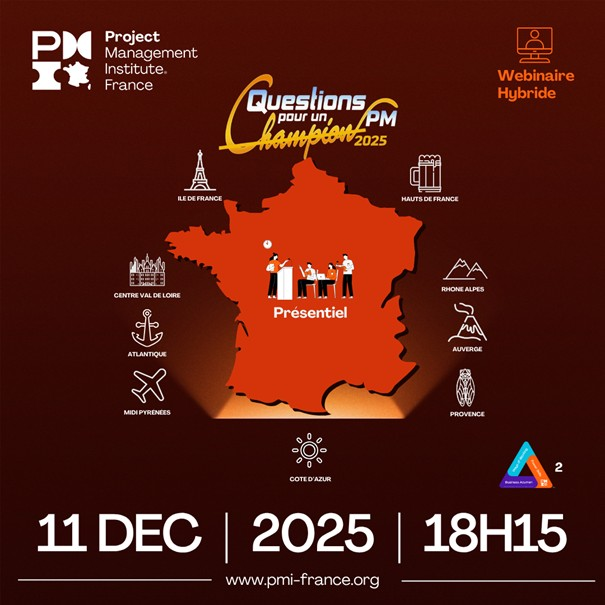

  

<h1 align="center">Eddy AZEBAZE - Projet Augmenté®</h1>

<strong>IT Project Leader (PMP® · CISM® · AWS CCP) - GRC • AI Act • Cybersécurité • Data &amp; Insights</strong>

  <a href="https://www.linkedin.com/in/eddy-azebaze-pmp-cism" title="Profil LinkedIn - Eddy AZEBAZE">LinkedIn</a> •
  <a href="mailto:eddy.azebaze@proton.me" title="Contacter Eddy AZEBAZE par email">Email</a> •
  <a href="https://calendly.com/eddy-azebaze-proton/30min" title="Réserver un appel de cadrage 30 minutes">Réserver 30&nbsp;min</a> •
  <a href="https://medium.com/@eddyazebaze" title="Articles Medium - Gouvernance, IA, GRC">Medium</a>

<!-- Badges de certifications alignés sur une seule ligne -->

  
  
  
  
  
  
  
  

<h2 id="sommaire">Sommaire</h2>
<ul>
  <li><a href="#proposition-de-valeur">Proposition de valeur</a></li>
  <li><a href="#etudes-de-cas">Études de cas & démonstrateurs</a></li>
  <li><a href="#evenements">Évènements & leadership</a></li>
  <li><a href="#methode">Méthode de delivery</a></li>
  <li><a href="#stack">Stack / outils</a></li>
  <li><a href="#mentions">Mentions & distinctions</a></li>
  <li><a href="#faq">Questions fréquentes</a></li>
  <li><a href="#cta">Passer à l’action</a></li>
</ul>

<h2 id="proposition-de-valeur">Proposition de valeur</h2>

Je co-pilote vos <strong>projets IT les plus exigeants</strong> pour en faire de <strong>véritables actifs stratégiques</strong> : mesurables, conformes et durables.
Intégration GRC, conformité (AI Act, NIS2, RGPD, DORA) et cybersécurité pour des environnements régulés (pharma, banque, santé).
Pilotage PMO, KPI/OKR et traçabilité complète pour des décisions <em>board-ready</em>.

<ul>
  <li><strong>Valeur mesurable</strong> alignée aux priorités métier.</li>
  <li><strong>Conformité démontrable</strong> (artefacts et registres auditables).</li>
  <li><strong>Delivery durable</strong> (contrôles, journalisation, réversibilité).</li>
</ul>

<em>« On ne livre pas un projet. On construit un actif stratégique : durable, traçable et auditable. »</em>

<h2 id="etudes-de-cas">Études de cas &amp; démonstrateurs</h2>

<h3>1. Chatbot PMO - zéro hallucination (offline-ready)</h3>

<strong>Problème</strong> : chatbots peu fiables, données non traçables. 
<strong>Solution</strong> : assistant hors-ligne (RAG + garde-fous), réponses sourcées et journalisées. 
<strong>Impact</strong> : qualification rapide des demandes, support projet fiable pour PMO/DSI. 
<strong>Liens</strong> : <a href="https://github.com/Eddyazebaze/pmo-chatbot/tree/main" target="_blank" rel="noopener" title="Dépôt GitHub - Chatbot PMO Zéro hallucination">voir le dépôt</a> ·
<a href="https://drive.google.com/file/d/1akBbd66K7mcZmJsnbZOp2HZwaU2-dxzj/view?usp=drive_link" target="_blank" rel="noopener" title="Démo vidéo - Chatbot PMO (Google Drive)">démo vidéo</a>

  

<h3>2. AI Act Readiness Scorecard - conformité prête audit</h3>

<strong>Problème</strong> : gouvernance traçable exigée (datasets, risques, registre). 
<strong>Solution</strong> : scorecard de maturité + artefacts (DPIA, journaux, notices). 
<strong>Impact</strong> : conformité prouvée, décisions COMEX plus rapides et mieux argumentées. 
<strong>Liens</strong> : <a href="https://github.com/Eddyazebaze/ai-act-readiness-scorecard" title="Dépôt GitHub - AI Act Readiness Scorecard">voir le dépôt</a> ·
<a href="https://aiactreadinesssscorecard.netlify.app/" title="Scorecard AI Act - démonstrateur live">scorecard en ligne</a>

<h3>Démonstrateurs réservés (projets confidentiels)</h3>

Ces projets illustrent des cas d’usage réels en <strong>GRC</strong>, <strong>IA</strong>, <strong>Cybersécurité</strong> et <strong>Data</strong>.

<ul>
  <li>Automated Compliance &amp; Incident Alert Flow (Make.com)</li>
  <li>Project Value Canvas (cadre 1-page)</li>
  <li>Audit Sécurité WordPress (OWASP ZAP)</li>
  <li>BI Santé - Dashboard OMS/OCDE (Power BI)</li>
</ul>

👉 Présentation disponible sur demande qualifiée :  
<a href="https://calendly.com/eddy-azebaze-proton/30min">réserver un échange</a>

<h2 id="evenements">Évènements & leadership</h2>

Je coordonne des initiatives qui renforcent la <strong>culture projet</strong> et la <strong>collaboration inter-branches</strong> au sein du PMI France.

<h3>Questions pour un PM 2025</h3>

Initiative nationale portée par le <strong>PMI France</strong> : coordination, cohérence et pilotage global de l’édition hybride.

  

<h3>ProBono - Les collectifs qui transforment l’entreprise de l’intérieur</h3>

Webinaire du <strong>pôle La Défense</strong> sur la transformation culturelle par les dynamiques collectives : dialogue, transmission et engagement au service de la performance durable.

<a href="https://pmi-france.org/blog/retour-sur-le-webinaire-probono-pole-la-defense-x-les-collectifs-comment-les-salaries-transforment-l-entreprise-de-l-interieur-20-mai-2025-2-a706" target="_blank" rel="noopener">Voir la présentation</a>

<h2 id="cta">Passer à l’action</h2>

📅 <a href="https://calendly.com/eddy-azebaze-proton/30min">Planifier 30 min</a> 
💼 <a href="https://www.linkedin.com/in/eddy-azebaze-pmp-cism">Profil LinkedIn</a> 
✉ <a href="mailto:eddy.azebaze@proton.me">Email direct</a> 
📰 <a href="https://medium.com/@eddyazebaze">Articles Medium</a>

© 2025 Projet Augmenté® - démonstrateurs fournis « as-is ». Conformité RGPD / NIS2 / DORA / AI Act. Dernière mise à jour : Novembre 2025.

