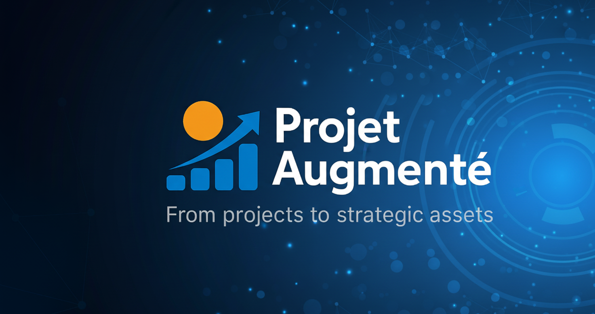
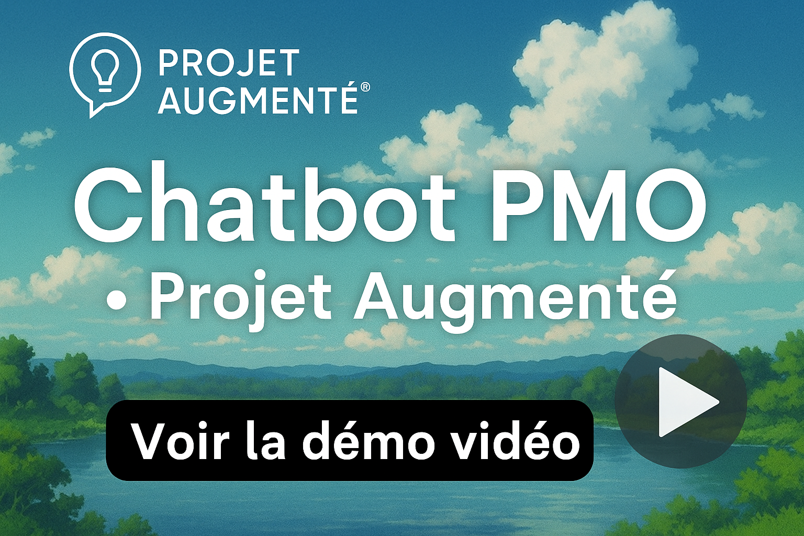
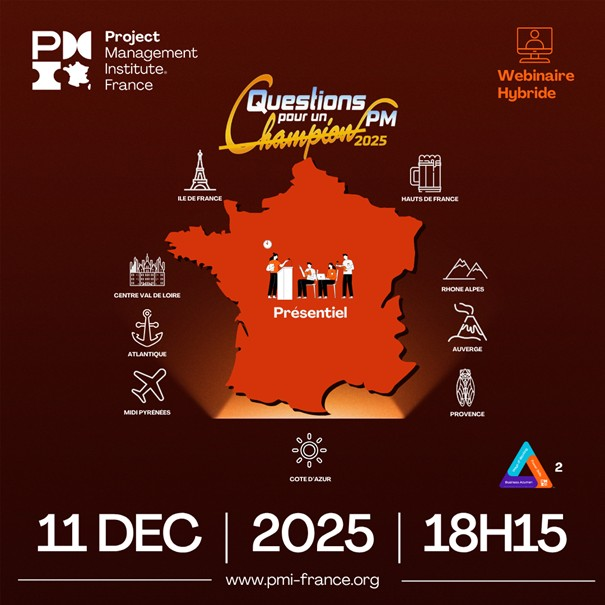

  

<h1 align="center">Eddy AZEBAZE - Projet Augmenté®</h1>

<strong>Gouvernance Cloud & Plateformes · PMP® · CISM® : Kubernetes, IA, résilience & auditabilité</strong>

  <a href="https://www.linkedin.com/in/eddy-azebaze-pmp-cism" title="Profil LinkedIn - Eddy AZEBAZE">LinkedIn</a> •
  <a href="mailto:eddy.azebaze@proton.me" title="Contacter Eddy AZEBAZE par email">Email</a> •
  <a href="https://calendly.com/eddy-azebaze-proton/30min" title="Réserver un appel de cadrage 30 minutes">Réserver 30&nbsp;min</a> •
  <a href="https://medium.com/@eddyazebaze" title="Articles Medium - Gouvernance, IA, GRC">Medium</a>

  
  
  
  
  
  
  
  

<h2 id="sommaire">Sommaire</h2>
<ul>
  <li><a href="#proposition-de-valeur">Proposition de valeur</a></li>
  <li><a href="#etudes-de-cas">Études de cas & démonstrateurs</a></li>
  <li><a href="#evenements">Évènements & leadership</a></li>
  <li><a href="#methode">Méthode de delivery</a></li>
  <li><a href="#stack">Stack / outils</a></li>
  <li><a href="#mentions">Mentions & distinctions</a></li>
  <li><a href="#faq">Questions fréquentes</a></li>
  <li><a href="#cta">Passer à l'action</a></li>
</ul>

<h2 id="proposition-de-valeur">Proposition de valeur</h2>

Les organisations n'ont pas seulement besoin de plus de technologie. Elles ont besoin de
<strong>plateformes qu'elles peuvent comprendre, gouverner, auditer et faire évoluer</strong>.
Je pilote aujourd'hui une offre Kubernetes critique (secteur énergie, on-prem + AWS), à
l'intersection de quatre sujets : <strong>Platform Engineering, gouvernance & auditabilité,
résilience & conformité (NIS2, DORA, AI Act), IA industrialisée</strong>.

<ul>
  <li><strong>Valeur mesurable</strong> alignée aux priorités métier.</li>
  <li><strong>Conformité démontrable</strong> (RACI, artefacts et registres auditables).</li>
  <li><strong>Delivery durable</strong> (contrôles, journalisation, réversibilité).</li>
</ul>

<em>« Une plateforme ne devient pas un produit parce qu'on l'appelle ainsi. Elle le devient
quand les équipes savent comment l'utiliser sans dépendre d'un héros disponible au bon moment. »</em>

<h2 id="etudes-de-cas">Études de cas & démonstrateurs</h2>

<h3>1. K8s Platform Governance Lab, rendre une plateforme Kubernetes gouvernable et auditable</h3>

<strong>Problème</strong> : une plateforme Kubernetes techniquement robuste peut rester
organisationnellement fragile, personne ne sait qui décide, qui valide, qui produit la preuve. 
<strong>Solution</strong> : démonstrateurs terrain (visual explorer, bootcamp, manifests RBAC/
NetworkPolicies) et artefacts de gouvernance (RACI plateforme, Build/Run, GitOps comme contrôle
d'auditabilité, gouvernance IA/vLLM). 
<strong>Impact</strong> : un référentiel réutilisable pour toute plateforme interne cloud, data ou IA. 
<strong>Lien</strong> : <a href="https://github.com/Eddyazebaze/k8s-platform-governance-lab" target="_blank" rel="noopener" title="Dépôt GitHub - K8s Platform Governance Lab">voir le dépôt</a>

<h3>2. AI Act Readiness Scorecard, conformité prête audit</h3>

<strong>Problème</strong> : gouvernance traçable exigée (datasets, risques, registre). 
<strong>Solution</strong> : scorecard de maturité + artefacts (DPIA, journaux, notices). 
<strong>Impact</strong> : conformité prouvée, décisions COMEX plus rapides et mieux argumentées. 
<strong>Liens</strong> : <a href="https://github.com/Eddyazebaze/ai-act-readiness-scorecard" title="Dépôt GitHub - AI Act Readiness Scorecard">voir le dépôt</a> ·
<a href="https://aiactreadinesssscorecard.netlify.app/" title="Scorecard AI Act - démonstrateur live">scorecard en ligne</a>

<h3>3. Chatbot PMO, zéro hallucination (offline-ready)</h3>

<strong>Problème</strong> : chatbots peu fiables, données non traçables. 
<strong>Solution</strong> : assistant hors-ligne (RAG + garde-fous), réponses sourcées et journalisées. 
<strong>Impact</strong> : qualification rapide des demandes, support projet fiable pour PMO/DSI. 
<strong>Liens</strong> : <a href="https://github.com/Eddyazebaze/pmo-chatbot/tree/main" target="_blank" rel="noopener" title="Dépôt GitHub - Chatbot PMO Zéro hallucination">voir le dépôt</a> ·
<a href="https://drive.google.com/file/d/1akBbd66K7mcZmJsnbZOp2HZwaU2-dxzj/view?usp=drive_link" target="_blank" rel="noopener" title="Démo vidéo - Chatbot PMO (Google Drive)">démo vidéo</a>

  

<h3>Démonstrateurs réservés (projets confidentiels)</h3>

Ces projets illustrent des cas d'usage réels en <strong>GRC</strong>, <strong>IA</strong>, <strong>Cybersécurité</strong> et <strong>Data</strong>.

<ul>
  <li>Automated Compliance & Incident Alert Flow (Make.com)</li>
  <li>Project Value Canvas (cadre 1-page)</li>
  <li>Audit Sécurité WordPress (OWASP ZAP)</li>
  <li>BI Santé, Dashboard OMS/OCDE (Power BI)</li>
</ul>

👉 Présentation disponible sur demande qualifiée :
<a href="https://calendly.com/eddy-azebaze-proton/30min">réserver un échange</a>

<h2 id="evenements">Évènements & leadership</h2>

Depuis février 2025, je porte le programme <strong>"Programme & Initiatives"</strong> en tant que
bénévole au <strong>PMI France</strong> : conception et pilotage d'événements nationaux et
régionaux, lancement d'initiatives d'acculturation IA pour dirigeants et PMO, animation
inter-branches et structuration de la gouvernance de projets validés en Conseil d'Administration.

<h3>Questions pour un PM 2025</h3>

Coordination nationale sur <strong>13 régions</strong> : cohérence et pilotage global de
l'édition hybride du quiz national du PMI France.

  

<h3>WomenByPMI 2026</h3>

Animation et coordination de la <strong>2ème édition nationale</strong> (1er juillet 2026).
<a href="https://pmi-france.org/conferences/questions-pour-un-pm-2025-le-quiz-national-du-pmi-france-copie-c34162" target="_blank" rel="noopener">Voir l'événement</a>

<h3>AI Speaker Tour</h3>

Initiative nationale d'acculturation IA pour chefs de projet, portée à travers plusieurs régions.

<h3>Commission Technique R26 2026, Les rencontres du PMI</h3>

Membre de l'<strong>équipe organisatrice, pôle IT-Tech</strong>, des Rencontres du PMI au
Futuroscope de Poitiers (8 et 9 juin 2026), un événement national réunissant pilotage,
programme, partenaires, logistique et finance. Contribution structurante, pas ponctuelle :
c'est ce même pôle IT-Tech qui porte la coordination technique des grands événements du PMI France.

  

<h3>ProBono, Les collectifs qui transforment l'entreprise de l'intérieur</h3>

Webinaire du <strong>pôle La Défense</strong> sur la transformation culturelle par les dynamiques
collectives : dialogue, transmission et engagement au service de la performance durable.

<a href="https://pmi-france.org/blog/retour-sur-le-webinaire-probono-pole-la-defense-x-les-collectifs-comment-les-salaries-transforment-l-entreprise-de-l-interieur-20-mai-2025-2-a706" target="_blank" rel="noopener">Voir la présentation</a>

<h3>Structuration & gouvernance de projets nationaux</h3>

Projets et initiatives validés par le Conseil d'Administration du PMI France, structurant le
programme dans la durée plutôt que par événements isolés.

<h2 id="methode">Méthode de delivery (sûre & mesurable)</h2>
<ol>
  <li><strong>Diagnostic</strong>, enjeux, risques, exigences réglementaires.</li>
  <li><strong>Cadrage</strong>, objectifs, KPI/OKR, feuille de route, RACI.</li>
  <li><strong>Delivery</strong>, itérations, contrôles, traçabilité IA/cyber.</li>
  <li><strong>Résultats</strong>, scorecards, dashboards, ROI, amélioration continue.</li>
</ol>

<em>Livrables</em> : project charter, RACI, artefacts conformité, runbook, rapport ROI.

<h2 id="stack">Stack / outils</h2>

  
Voir la stack complète

  <h3>Plateforme & Cloud</h3>
  
Kubernetes, Docker, Helm, ArgoCD, AWS 
  RBAC, NetworkPolicies, GitOps

  <h3>Gouvernance & Delivery</h3>
  
GitHub Projects, Notion, Miro, MS Project, ClickUp 
  <strong>Cycle de vie projet (SDLC)</strong> : cadrage, build, test, run

  <h3>Data & Insights</h3>
  
Power BI, Tableau, Qlik Sense, Dataiku, Python (Pandas) 
  Langages : HTML, SQL, DAX

  <h3>IA & Agents</h3>
  
OpenAI API, Claude, Qwen, Botpress, LangChain, LangFlow

  <h3>Cybersécurité & Conformité</h3>
  
OWASP ZAP, Security Headers, Aravo, Archer, OneTrust

  <h3>Automatisation & Orchestration</h3>
  
Make.com, Zapier, n8n, Databricks, Apache Airflow

<h2 id="mentions">Mentions & distinctions</h2>

<strong>Top 20, Favikon 2025 : Project Managers France</strong> 
Classement des leaders de projet axés impact et gouvernance. 
<a href="https://www.favikon.com/fr/blog/top-project-managers-france" title="Classement Favikon Project Managers France 2025">voir le classement</a>

<h2 id="faq">Questions fréquentes</h2>

<h3>Pilotage & Valeur</h3>

  
Comment mesurez-vous la valeur d'un projet IT ?

  Par un modèle à cinq dimensions : valeur business, utilisateur, opérationnelle, réglementaire et stratégique.
  Chaque livrable est relié à un indicateur concret (KPI/OKR) et à une priorité métier validée par le sponsor.

  
Quelle est votre approche de cadrage projet ?

  Un cadrage clair, orienté résultats : RACI, objectifs, feuille de route, et livrables audités.
  L'enjeu : garantir la cohérence entre ambition, ressources et valeur mesurable.

  
Quelle différence entre un projet « livré » et un projet « abouti » ?

  Un projet livré respecte le plan ; un projet abouti crée une valeur durable, documentée et mesurable.
  C'est la base de l'approche Projet Augmenté®.

<h3>Gouvernance, Conformité & Plateforme</h3>

  
Comment gouvernez-vous une plateforme partagée par plusieurs équipes ?

  Par un RACI explicite (qui décide, qui exécute, qui valide, qui est informé), un partage
  Build/Run assumé, et une architecture qui rend la non-conformité difficile à produire
  silencieusement (GitOps, politiques de sécurité comme contrôle, pas seulement comme document).

  
Comment gérez-vous les risques IA, RGPD ou cybersécurité ?

  Par une approche GRC intégrée : DPIA, registre des traitements, plan de contrôle et audit readiness.
  Objectif : transformer la conformité en levier de performance durable.

  
Comment abordez-vous les sujets d'infrastructure (cloud, sécurité, intégration) ?

  Avec une approche <strong>DevSecOps et ITIL 4</strong> intégrée dès la conception : conformité,
  performance et sécurité avancent ensemble. Chaque environnement est conçu pour être
  <strong>scalable, traçable et résilient</strong>, sans compromis sur la gouvernance ni la qualité de service.

<h3>Produit & Collaboration</h3>

  
Quelle est votre approche orientée « produit » ?

  Un projet, ou une plateforme, est un produit vivant : il évolue, se maintient, et délivre une
  valeur d'usage continue. La valeur se mesure autant dans le temps que dans le livrable initial.

  
Quelle est la première étape si nous collaborons ?

  Un diagnostic 30-60-90 : évaluation des enjeux, risques, et livrables attendus.
  Puis un pilote concret, mesuré, et <em>board-ready</em>.

<h2 id="cta">Passer à l'action</h2>

📅 <a href="https://calendly.com/eddy-azebaze-proton/30min">Planifier 30&nbsp;min</a> 
💼 <a href="https://www.linkedin.com/in/eddy-azebaze-pmp-cism">Profil LinkedIn</a> 
✉ <a href="mailto:eddyazebaze@proton.me">Email direct</a> 
📰 <a href="https://medium.com/@eddyazebaze">Articles Medium</a>

© 2026 Projet Augmenté®, démonstrateurs fournis « as-is ». Conformité RGPD / NIS2 / DORA / AI Act. Dernière mise à jour : Juillet 2026.

